# IvyGuide

### Harvard Summer School 2023:  S-71 Agile
### Team: BurndownMasters
- Malaika Goswamy: Scrum Master, Developer
- Bharat Santhosh Raja: Developer
- Bradley Ross:  Product Owner, Developer

### tl:dr 
IvyGuide is a student-maintained web app providing a singular, informal location for all tips, tricks, 
guides, and necessary information for incoming Harvard summer school students living on campus. 

## Deliverable 1: June 26, 2023
1. Canvas Group: Burndown Masters Student Groups: https://canvas.harvard.edu/courses/119743/groups
2. Team Name: **BurndownMasters**  
Public Discord Channel: https://discord.gg/sBKM6RZy (depreciated)
Public Slack Channel: https://agilesoftwarecourse.slack.com/archives/C05E5KBS0E9
3. Public GitHub: https://github.com/bar181/BurndownMasters
4. Team Name: **BurndownMasters** 
   - Malaika Goswamy: Product Owner, Scrum Master
   - Bharat Santhosh Raja: Developer
   - Bradley Ross: Developer
5. Product Name: **IvyGuide**
6. Far Vision: **The Ultimate Orientation Resource for Students Everywhere** 
7. Near Vision: **Working prototype explaining orientation tips for new Harvard Summer Students**
8. Stakeholder Types: 
   - Harvard Summer School Students
   - Harvard Summer Residential Life Staff
   - Local Cambridge Community
   - Parents & Family of Students
9. Stakeholder Persona Real Names
   - Mya Miller, Internation student (Harvard Summer School Students)
   - Jamil Kikland, Dunster Hall Proctor (Harvard Summer Residential Life Staff) 
   - Noch, Owner of a Pizza restuarant in Harvard Square (Local Cambridge Community) 
   - Mya's Mom (Parents & Family of Students)
10. User Persona: **Mya Miller** 

11. Initial Product Backlog public link 
Link to Public Miro: https://miro.com/app/board/uXjVM73AdYc=/?share_link_id=542659522333
12. Product Backlog items - 11 total (see Miro)
13. User story for each (see Miro), 
14. Ordering in priority (see Miro) 
Rationale for ordering
    - 1st, ensure dependencies are complete (e.g. cannot rate a post until a post is created)
    - 2nd, make it easy to provide amazing, quality content targeted to our primary stakeholder (i.e. we want Mya to love our product) 
    - 3rd, add incremental value with additional features to enhance Mya's experience 
    - 4th, satisfy needs of other stakeholder types (e.g. make sure Mya's mom and Noch love our product too)
15. Definition of Ready   
    - Title: the user story has a relevant title 
    - User story opening sentence: the user story's opening statement directly relates to the content in the format 
    As a ___ (name/type of key stakeholder where possible), I want ____ (what), So that ___(why)
    - Additional details: list of backlog specific items and dependencies that area required before starting
    - Acceptance criteria: all team members have a mutual understanding of the story and the goal
    - Estimated in story points: Points should be from 1-3 based on effort as determined by dev members. For reference: 3 is the largest PBI allowed (e.g. intial set up), 1 is a minor feature (e.g. add rating) 
    It is encouraged to have backlog items at 1 but this is not required
    - Key functional tests (if required): Identify an input that will provide a desired outcome (e.g. shows the star rating out of 5)
    - Dependencies ready: List of any unique dependencies with confirmation of done (e.g. admin rights required for editing)
16. Estimates in relative size units - See Miro 
17. Whole team relative size: 20 Total Points across 11 backlog items 
Activity Name: **Agile Animals**  
    - Identify dev team skill sets
    - Group PBI into 3 classifications (1 small, 3 largest)
    - Classification done by dev team based on dev team experience/skill set not external benchmarks
    - Any PBI larger than 3 were decomposed as re-classified
18. Confirmation Dev-only estimates: 
Bharat <agree> 
Brad <agree>

## Deliverable 2: First Sprint June 29, 2023
1. Sprint planning: Story Point Forecast 8 
2. Rationale for forecast: Guess based on experience
Brad has some experience with setting up python and authorization but not first coding language.
The hosting configuration timing is unknown (based on provider) - we should start immediately as this may take time to implement.
Having a live site with some content is the top priority.

3. Sprint planning checklist
   - Stories from top of Product Backlog: TRUE
   - Aggregate size < forecast: TRUE
   - Developers participated: TRUE (all 3 devs participated)
   - Proof of Developer participation: TRUE (we attest)

Change in Sprint backlog:
BEFORE

END
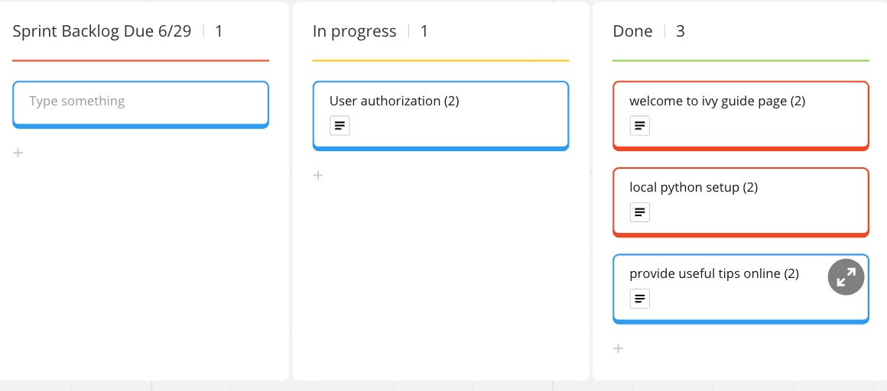

4. Backlog stories right size, <50% total effort, refine large items: TRUE
We needed to decompose items: DONE  
5. Tasks:
   - decompose PBI into task: 4 items (8 points)
   - tasks listed in sprint backlog: TRUE (total tasks: 16)
6. MIRO for sprint backlog: https://miro.com/app/board/uXjVM6jdFDo=/
7. Public sprint burndown chart: https://docs.google.com/spreadsheets/d/1aXzgwyhYiIOxKWGeQJib_VyrE4WT63Q_pTDonNz1vxI/edit?usp=sharing
8. Daily scrums: 2 completed

   9. Member activity checklist
   Discussion occurred: TRUE for all scrum meetings
   Task list organized by PBI: all devs responsible, vital notes in comments, use dev initials and assign status

       DAILY SCRUM 1: June 28
   
       welcome to ivy guide page (2 story points) - IN PROCESS 2/4 TASKS COMPLETE
       - identify host (DONE by BA) Digital Ocean ;)
       - configure server (IN PROCESS - BA) Initial setup works, Flask not set up 
       - upload python environment (IN PROCESS - BA) - started
       - welcome message to visitors (DONE - BA) live content appears as expected

       local python setup (2) - IN PROCESS 2/4 TASKS COMPLETE
      - python setup (DONE BR) Pushed to github with commit 'Sprint 1: ready for 1st deploy' ;)
      - welcome note (IN PROCESS BR) 
      - navigation 
      - set up tests 
   
       User authorization (2)
      - database setup
      - log in and register page 
      - nav bar links 
      - error handling - register functionality

       provide useful tips online (2)
      - write 5 posts (IN PROCESS MG) - stakeholder interviews
      - wireframe frontend style (IN PROCESS MG) - user interface option
      - display dynamic content 
      - add frontend style framework 
   
        Impediments: 
      - MG may have work call tonight.  Removal plan: BR and BA can work on setup and config.  MG will provide content for posts
      - We need to take a break after class and cannot start again until after 8pm.  Removal plan: plan to start at 8:30
      - Digital Ocean has a variety of offerings and not sure what to select.  Removal Plan: cost/benefit analysis and select a plan with at least 2 admins. 
      - Flask is tough to add to live server: Removal plan: read hot-to guides

       DAILY SCRUM 2: June 29

        Summary: we are good to go.  Live site works as expected.  Meeting with stakeholder with no known issues or bugs.

       welcome to ivy guide page (2 story points) - DONE ;)
       - identify host (DONE by BA) Digital Ocean ;)
       - configure server (DONE - BA) Initial setup works, Flask works, live site works 
       - upload python environment (DONE - BA) - works amazing
       - welcome message to visitors (DONE - BA) live content appears as expected

       local python setup (2) - DONE ;)
      - python setup (DONE BR) Pushed to github with commit 'Sprint 1: ready for 1st deploy' ;)
      - welcome note (DONE BR) Hero image with welcome text
      - navigation (DONE BR) Basic navbar with link to home page 
      - set up tests (DONE BR) set up unit_tests.py, test login/register form functionality formats
   
       User authorization (2) - UNABLE TO MEET DEADLINE 
        
      - database setup
      - log in and register page (IN PROCESS BR) - ui done, tests done, functionality not done
      - nav bar links (IN PROCESS BR) - link to register, login ready but not shown 
      - error handling - register functionality

       provide useful tips online (2) - DONE ;)
      - write 5 posts (DONE MG) 11 posts done, 6 in live site
      - wireframe frontend style (DONE BR MG) - use card style with title and text
      - display dynamic content (DONE BR) - uses loop to show all tips (no database)
      - add frontend style framework (DONE BR) uses tailwindcss, daisyui

10. Impediments and Impediment recourse
Scrum June 28
    - python local config issues: SOLVED - revert commit, reinstall flask
    - python environments not the same across dev - high priority - TO SOLVE collaborate to ensure consistency that we can all code together
    - not sure if we can use existing repo with Digital Ocean - TO SOLVE research and test

Scrum June 29
    - MG had a outside work issue but able to provide content
    - We need to find a stakeholder for live product review.  

11. Pair programming evidence:

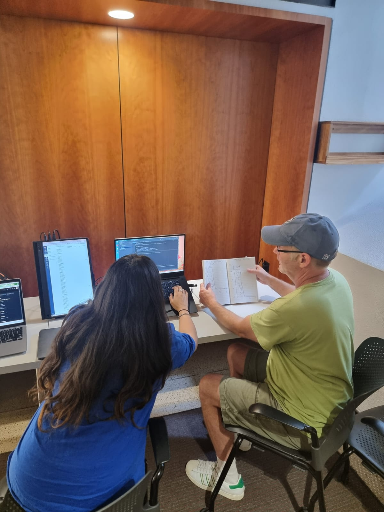
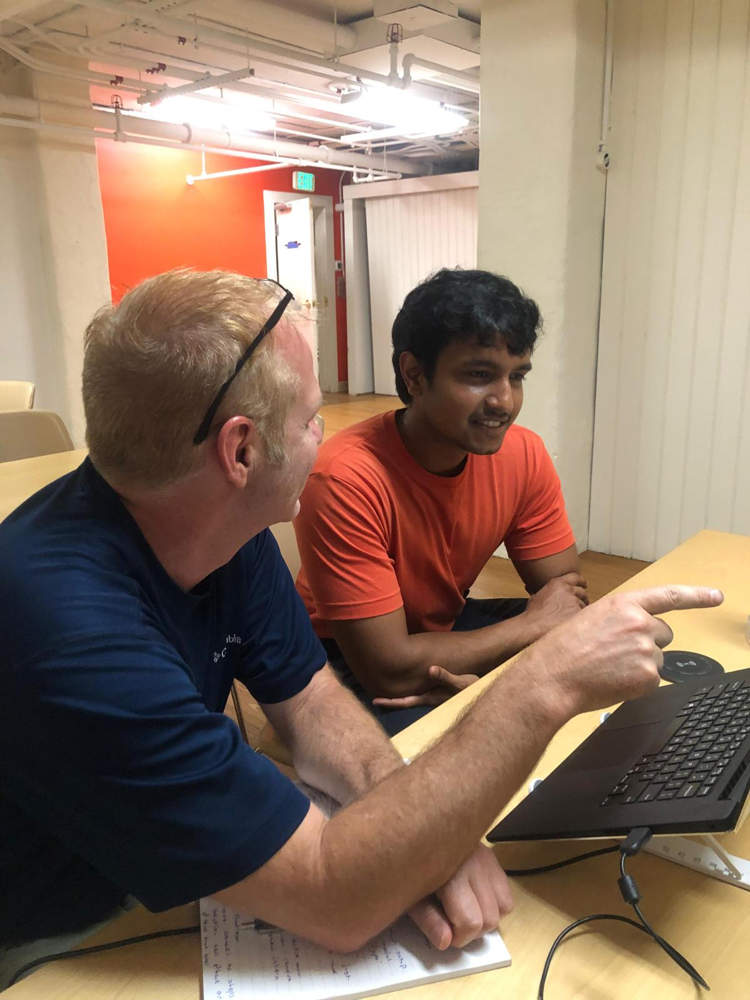
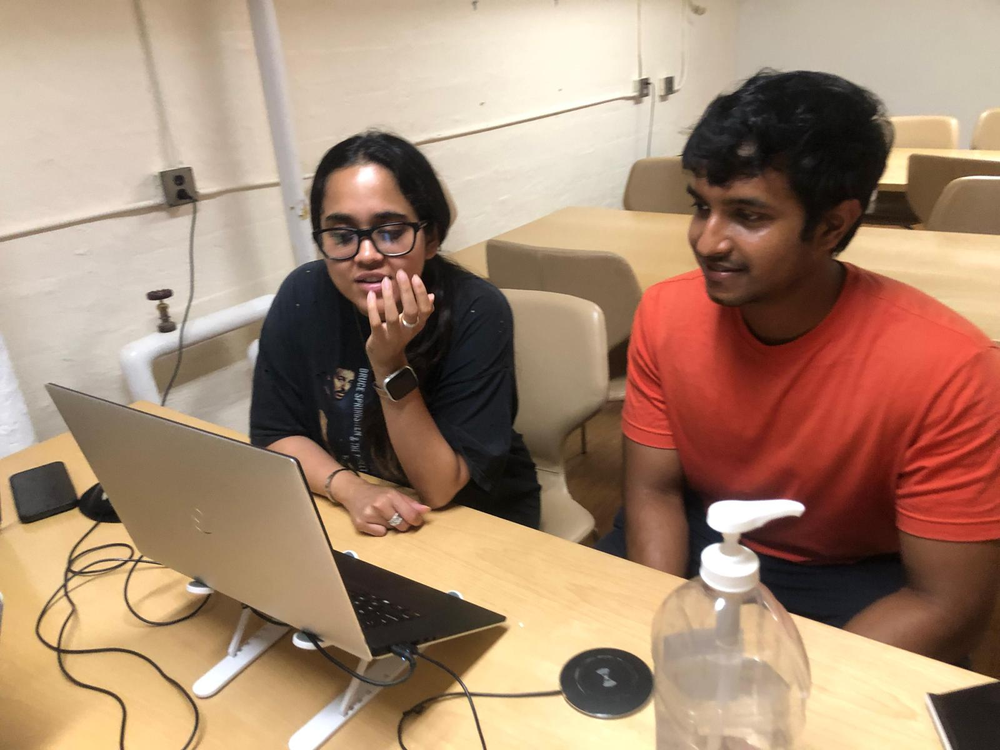

12. Evidence of TDD with minimum 10 tests: 16 tests DONE (21 asserts)
    - see unit_tests.py (results: all green)
13. Sprint Review: done

    ### Feedback
    - We covered the hardest part of this product where devs had the least amount of experience    

    ### Backlog changes based on feedback from stakeholder + team
    1) NEW Environment change - snacks and location change (1 story point)
    2) NEW Content writing - 30 new posts with title, text, category (2 points)
    3) HIGHER PRIORITY - category functionality, requires database functionality (2 points)
    4) LOWER PRIORITY AND USER STORY CHANGE- create user account (previously authorizations), lower priority based on stakeholder feedback - prefer to see more content first but really want a harvard.edu section
    5) HIGHER PRIORITY moderators creating content

14. Product increment is working software

    LIVE product  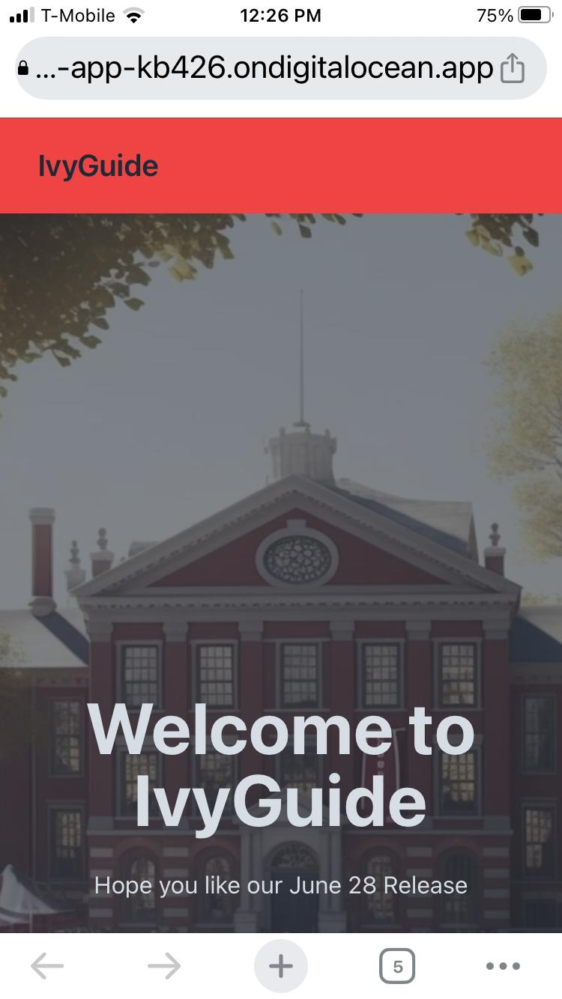
    Software public URL: https://coral-app-kb426.ondigitalocean.app/
    invitation 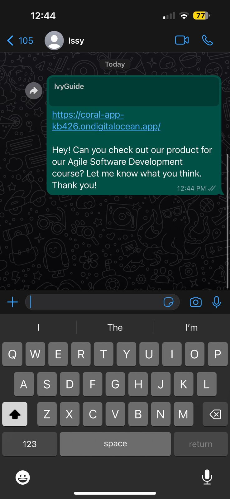

15. One stakeholder attends sprint review

    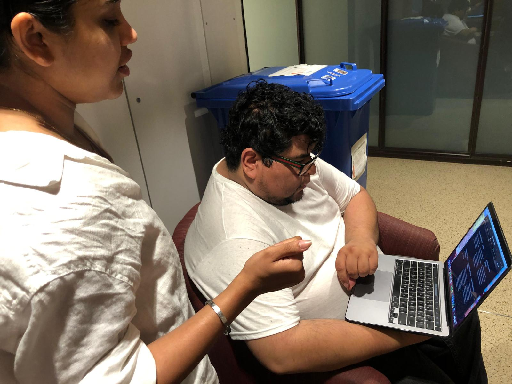
    Revisited backlog based on feedback: TRUE
    - feedback provided by Hebber
    - site looks great
    - I find it useful
    - More content would be helpful
    - I do like the idea of a "Harvard Student Only section" - then you can put stuff in that we only have with a harvard.edu website (like Facebook did)
    - Being able to see a variety of posts would be good - but only for other Harvard students (not in public forum)
16. Sprint retrospective: DONE
    General feedback
    - modified BPI based on feedback
    New PBI added to top of list: 
    - 1) Working environment changes (meeting in the basement is not sustainable we need snacks, A.C., better lighting) 
    - 2) Authorization was not completed and need to be reevaluated for next sprint and included as a PBI 
    
17. All BPI are true user stories: BPI near top of list were restated

## Deliverable 3: Sprint 2 - July 3, 2023
1. Sprint Planning
   - Forecast is 7 story points for sprint 2 (4 BPI)
2. Rationale for forecast:
    - We completed all the setup work in the last sprint (limited experience on team), 
    - the remaining set up work is minimal 
    - Last sprint we accomplished 6 story points and using 'Yesterday's Weather' we assume close to the same
    - Some of the tasks from the last sprint were completed
    
3. Sprint planning checklist (with proof)
   - Pulled stories from top of product banklog: True (we re-prioritized based on feedback + added 1 item from retrospective)
   - Total story points is 7, largest PBI is 2 story points
   - All 3 dev participated in the activity: We assert this is True (see several images of proof)
   - Only dev paticipated: True, while 2 dev have multiple roles, both restricted contributions based on dev roles
4. Decompose user stories: Backlog stories right size, <50% total effort, refine large items: 
    - stories right size: True max is 2 points (< 50% of total)
    - Use case 'too large': We refactored auth story item to 2 items to ensure no item is too large
    - All user stories were updated
    

5. Dev tasks
   - Dev tasks: DONE for each PBI and shown in the Miro kanban board 
   - see Miro for task list in sprint backlog (or daily scrums)
   - https://miro.com/app/board/uXjVM5h2vXo=/
6. MIRO for sprint backlog
   - see Miro for tasks in sprint backlog (public view)
   - https://miro.com/app/board/uXjVM5h2vXo=/
7. Public sprint burndown chart:
   https://docs.google.com/spreadsheets/d/1oet5rf1R_MLOAHF8WQiGeeEle7JRoBY05aYe54bK-dM/edit?usp=sharing 
   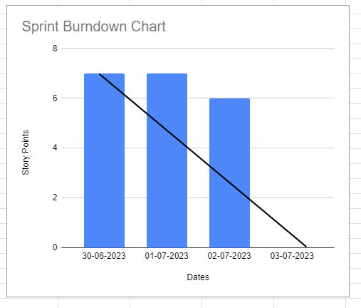
8. Daily scrums: (insert pics)

    July 1
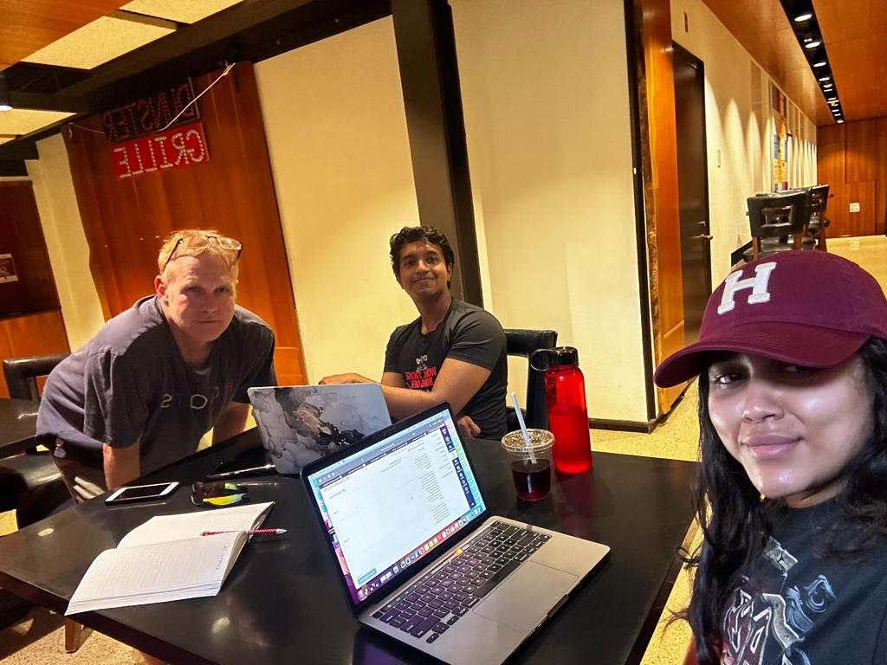
    July 2
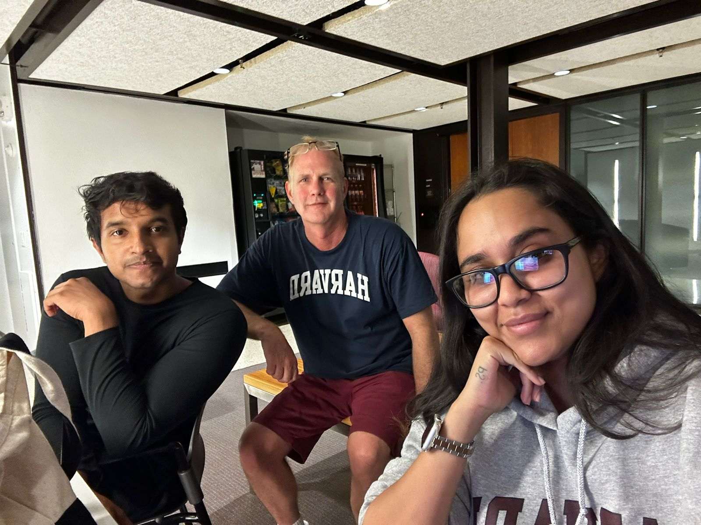
    July 3 - no image available 

9. Member activity checklist Discussion occurred:

    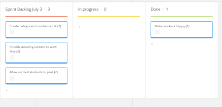
    DAILY SCRUM 1: July 1 accomplishments
   
   ### PBI 1: Working Environment - DONE 1/1 TASKS COMPLETE
   - New location (DONE by MG) Dunster Basement ;)

    ### PBI 2: Create categories to enhance UX: IN PROCESS 2/5 TASKS COMPLETE
    - identify category names: (IN PROCESS by MG) via talking with current students
    - create a database and ensure connection (IN PROCESS BA)
    - upload post content to database
    - UI category buttons, new wireframe, new routes (DONE BR) - 
    - show content by category
    
    ### PBI 3: Provide amazing content to wow Mya: IN PROCESS 2/4 TASKS COMPLETE
    - New content: : (IN PROCESS by MG) 20 posts ready in draft form via talking with current students
    - Transpose content into database: 
    - DB retrieve content by category:
    - User form post:
    
    ### PBI 4: Approved users can post: IN PROCESS 2/4 TASKS COMPLETE
    -  login functionality: (IN PROCESS by BR) - package installed
    - new DB table for approved users with email, author name:
    - login button on navbar, login page with verification:
    - post page with form posted as new item in database:
   
    

   ### Planned work  working on 7 tasks (all 3 devs involved)
   PBI 2: Create categories to enhance UX: 2 tasks planned for DONE
    - identify category names: MG plans DONE - no impediments 
    - create a database and ensure connection: BA plans DONE - no impediments
    - 
    PBI 3: Provide amazing content to wow Mya: 3 tasks planned for DONE, 1 potential impediment
    - New content: : MG plans DONE - no impediments
    - Transpose content into database: BA plans to start - impediments: pending successful database connections
    - DB retrieve content by category: BA plans to start - impediments: pending successful database connections
    - 
    PBI 4: Approved users can post: 2 tasks planned for DONE
    -  login functionality: BR plans DONE - no impediments
    - login button on navbar, login page with verification: BR plans DONE - no impediments
   
   ### Impediments: 1 potential
   - Some dependencies.  No resolve plan needed but team aware may require additional effort next day to help
- 

  
  DAILY SCRUM 2: July 2 accomplishments
   _TODO_SPRINT_BACKLOG_IMAGE

   ### PBI 1: Working Environment - DONE 1/1 TASKS COMPLETE
   - New location (DONE by MG) Dunster Basement ;)

  ### PBI 2: Create categories to enhance UX: IN PROCESS 2/5 TASKS COMPLETE
  - identify category names: (DONE by MG) - 5 to be on live site
  - create a database and ensure connection (IN PROCESS BA) - tested local works, live to do
  - upload post content to database (IN PROCESS BA, BR, MG)
  - UI category buttons, new wireframe, new routes (DONE BR) - 
  - show content by category (IN PROCESS BR, MG)
    
  ### PBI 3: Provide amazing content to wow Mya: IN PROCESS 2/4 TASKS COMPLETE
  - New content: : (IN PROCESS by MG) 29 posts ready - multiple for each category
  - Transpose content into database: IN PROCESS (BA, MG) - files shared
  - DB retrieve content by category: IN PROCESS (BA, MG) - files shared
  - User form post: IN PROCESS (BR, MG)
    
  ### PBI 4: Approved users can post: IN PROCESS 2/4 TASKS COMPLETE
  -  login functionality: (IN PROCESS by BR) - new tests created
  - new DB table for approved users with email, author name:
  - login button on navbar, login page with verification:
  - post page with form posted as new item in database:
    
    !

    ### Planned work  working on 7 tasks (all 3 devs involved)
    PBI 2: Create categories to enhance UX: 2 tasks planned for DONE
    - identify category names: MG plans DONE - no impediments 
    - create a database and ensure connection: BA plans DONE - no impediments
    - 
    PBI 3: Provide amazing content to wow Mya: 3 tasks planned for DONE, 1 potential impediment
    - New content: : MG plans DONE - no impediments
    - Transpose content into database: BA plans DONE - no impediments
    - DB retrieve content by category: BA plans DONE - impediments: pending successful database connections
    - 
    PBI 4: Approved users can post: 2 tasks planned for DONE
    -  login functionality: BR plans DONE - no impediments
    - login button on navbar, login page with verification: BR plans DONE - no impediments
    

  ### Impediments:  1 potential
   - Some dependencies.  No resolve plan needed but team aware may require additional effort next day to help

10. what we did the past 24 hours: see item 9 (marked as DONE or IN-PROCESS) 
11. what we will do the next 24 hours: see item 9
12. any impediments: see item 9

13. update sprint task board TWICE and burndown chart (with proof)
Updated 3 times (below is proof of 2 times)
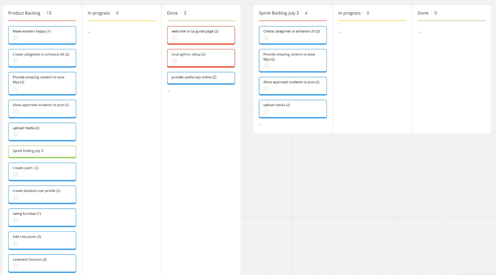
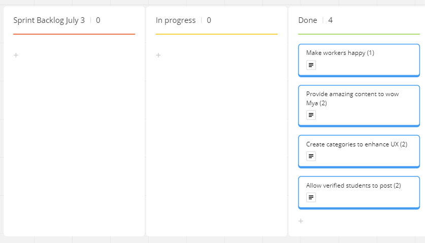

14. Pair programming evidence:
15. TDD evidence with 20 tests 
    - Updated to include directory: tests (per feedback on last grades report)
16. sprint review 
    - sprint review was done
17. Product increment is working software
- working software URL: https://coral-app-kb426.ondigitalocean.app/
- invitation __TODO__IMAGE__
- screen cap of software __TODO__IMAGE__
18. stakeholder attends sprint review (with proof)
- DONE with Nat (Summer student from Dunster Hall)
19. sprint retrospective 
- retrospective done: True
- all team members present (MG, BA, BR)
- Changes identified: Limit meetings to 2 hours (with 1+ hour break between meetings), Finish meetings by 10pm (latest), If possible have 2 people pair programming while the other updates documents 
- Recommendations to be included in next sprint planning as the most important items
- Evidence (marked as agreed by all devs): MG agree, BA agree, BR agree
21. All BPI are true user stories:
- all items near the top of the product backlog were revisited to ensure true user stories
- next spring review will update the feedback from a student during the sprint review